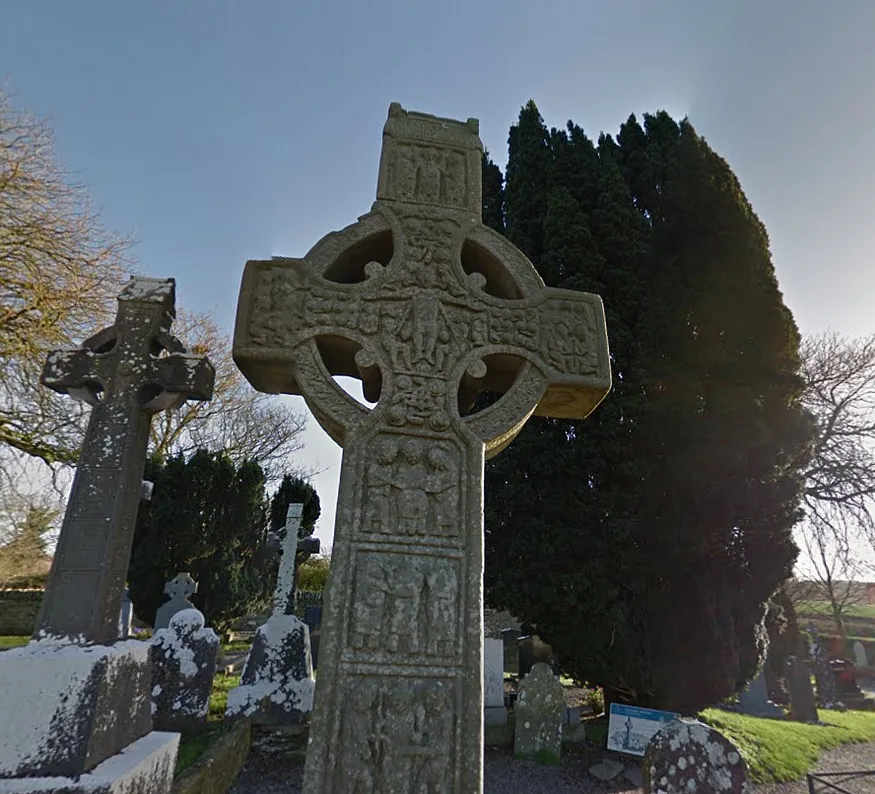
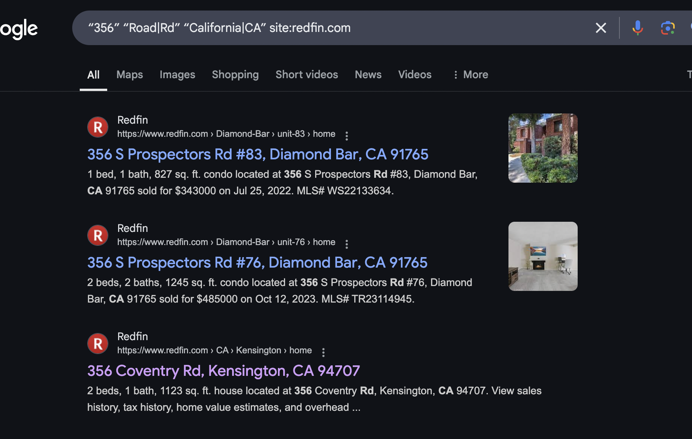

# CTF Description
> A few easy OSINT challenges from the Hack The Box Cyber Apocalypse CTF 2025

## Echoes in the Stone (Very Easy)

> In Eldoria’s twilight archives, Nyla examines an ancient Celtic cross, its carvings rich with forgotten history. As her enchanted crystals illuminate its patterns, she traces its significance across realms and centuries. Finally, the monument’s true name materializes in glowing script — another mystery unraveled by Eldoria’s finest information seeker, who knows that even stone holds secrets for those who listen.

## Solution

This was a super easy challenge. Do a basic image reverse lookup to find the name.

### FLAG: ``HTB{Muiredach_High_Cross}``

## The Stone That Whispers (Very Easy)

> In Eldoria’s twilight archives, Nyla studies a mysterious monument, her enchanted crystals illuminating ancient maps. The legendary Stone of Destiny calls to her from scattered records across realms. As her magical threads weave connections, its true name emerges in glowing script — another mystery unraveled by Eldoria’s master information seeker, who knows that every artifact leaves traces for those who can read the signs.

## Solution

Another very easy challenge. Basically find the flag the same way as the previous one with reverse image search. Afterwards I checked the Wiki page and found the flag name.

### FLAG: ``HTB{Lia_Fail}``

## The Hillside Haven ("Easy"...)

> Nyla channels her magic into a grand crystal, summoning an aerial view of the Western Hills district. Her task: locate a noble family’s ancestral home, its entrance marked by a numerical rune holding vital diplomatic secrets. As she traces hidden pathways and examines estates, her enchanted sight sharpens, illuminating the unique magical signature of one doorway. The glowing numerical sigil confirms her discovery — another secret unveiled by Eldoria’s master information seeker, who knows that even among countless dwellings, no two magical marks are ever the same. Flag Format: HTB{Number_StreetnameRoad}

## Solution

This challenge was tagged as Easy but most people were in agreement that this was one of the harder OSINT challenges. 

From this image we need to find the street address of the house. The image gives us a few clues.

1. We can see "356" as the house number on the door
2. The blurred license plate can be used to find the state

After doing some searching for **Western Hills** on Google many of the results showed up with places in California. This was furthur confirmed by using a site called **geohints** that has images of different places license plates.

Assuming this was correct I continued to search through Google maps for places in California that could match our image. This did not work so I had to come up with something new.

I decided to do some Google dorking with the info we had to try and narrow down our searches. Originally I used:

<code>“356” “Road|Rd” “California|CA”<code>

But after seeing many promissing results from the site **redfin.com** I decided to include that into the query:

<code>“356” “Road|Rd” “California|CA” site:redfin.com<code>

After many Google pages later I found the page with the location.

Which has our exact house image

### FLAG: ``HTB{356_CoventryRoad}``

