## Challenge Description

> I discovered a leaked Discord chat where two individuals discussed a powerful bot used to track cybercriminals. One plans to use the bot to target someone, while the other warns of the risks. I’ve decided to investigate the bot’s origin, its role in cybercrime, and who's controlling it. Flag Format: 0xL4ugh{}


## Solution

Theres a few key points to consider when doing our research for this challenge
1. We get 2 names Za8lola and 7amoksha from the chat
2. We also see someone else named MM0X who was talking about the bot in a discord server
3. Its been tracking criminals since 2021

Doing mass searches for these users returns nothing useful.
From our discord server we cant find any users named Za8lola or 7amoksha but we do see someone named MM0X who shares the other discord server with us (both these servers are for the same CTF)

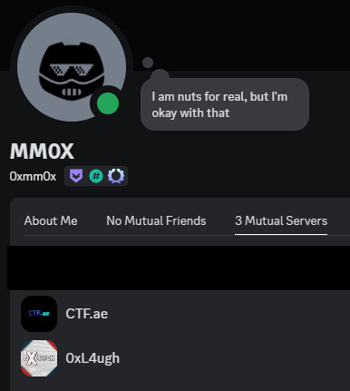

Since we have a clue that its been working since 2021 we can search for all his posts starting from the oldest

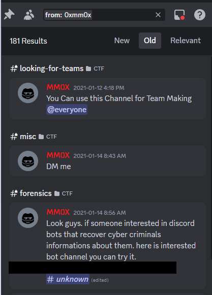

We see that theres an unknown channel/server that hes referring to here however its unavailable

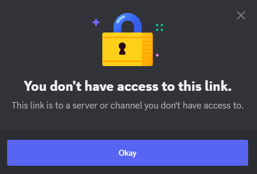

If we right click on that unknown server we can copy the link we’ll be able to get the server ID. https://discord.com/channels/1321167893559382100/1321167894163226737/1321189372854276098

From this we can use an online tool (https://discord-avatar.com/en/server) to search Discord server by ID and we’ll find this server 

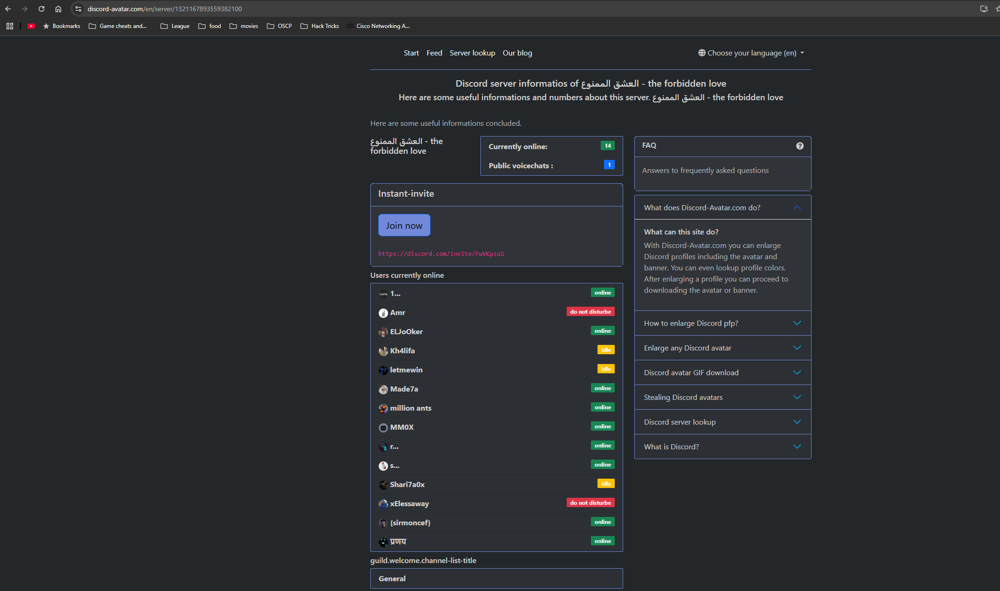

We join the discord server and see a few familiar names. We see MM0X and 7amoksha from the screenshot.
We also see the bot that we’re after called Made7a.
This bot also has a role called Flower that was added later on as a hint.
This bot has a few commands that we can use.

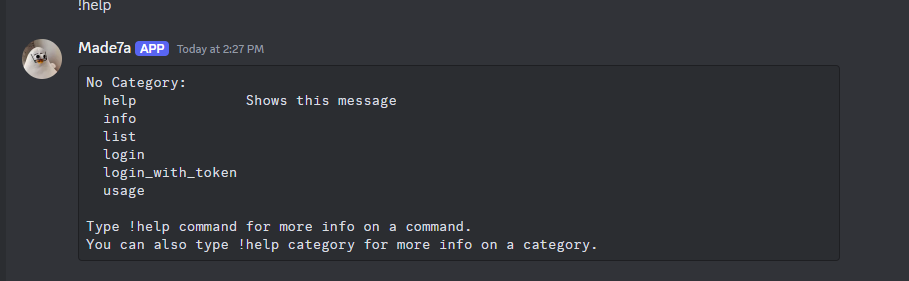

```
!list will print out a list of users in the database
!info will give us the info about that user
!login will generate a jtw for us to use. This token is role: guest by default
!login_with_token will just take a token parameter and login with it
```

We first get the list of users 

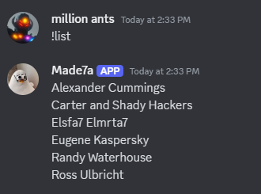

We try every user with !info and we can get a result for each except for Elsfa7 Elmrta7 which needs admin user to use it. This is probably where the flag will be (it was).

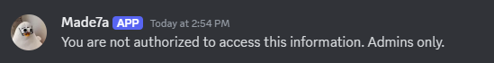

We try to do some JWT bypasses and brute force to try and get the key but it dosent work so then we dig deeper. 
If we click on 7amoksha’s profile we’ll see that his careless actions have caused him to become a victim of the hacker.

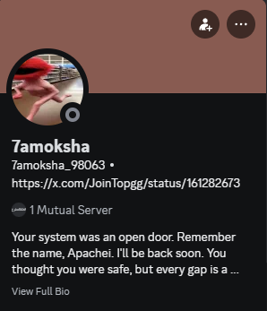

The URL Topgg is a Discord bot website but the actual link is invalid. However, with the new name Apachei we can use it to get some more info.
We do a Sherlock search and get a ton of links. The only useful one is the Github.

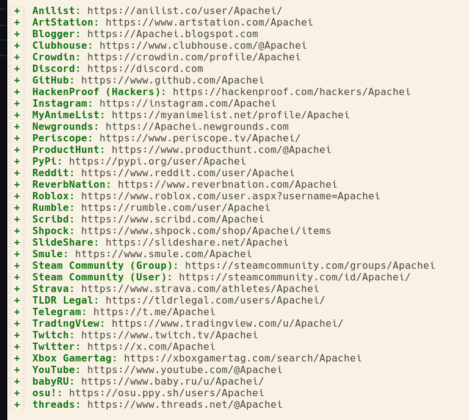

This guy has one repo (base64 decodes to the bots name)

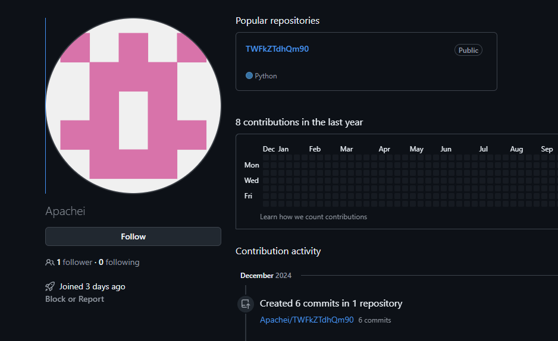

The current Botdis.py file contains a rick roll gif

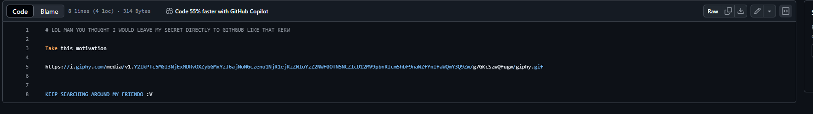

Theres 6 commits we can look through 

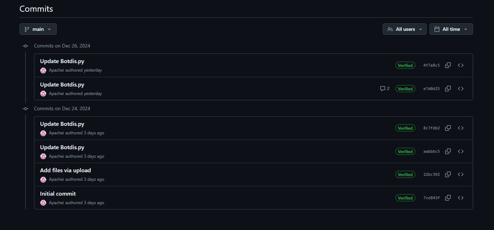

The .patch file returns a name and an email that was not part of the challenge
The second commit shows the entire backend code including a secret key

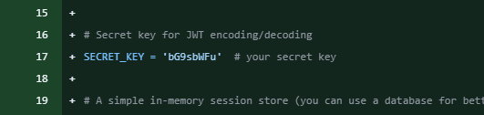

We try using the key to craft our JWT but it dosent work so he must have changed it
Commit 4 also contains this comment. The ID just relates to 7amoksha’s discord profile

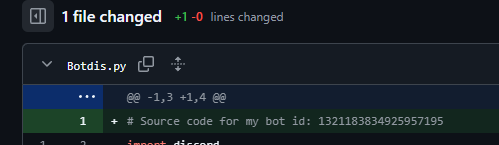

Commit 5 removes the source code and he BMs us in the comments some more

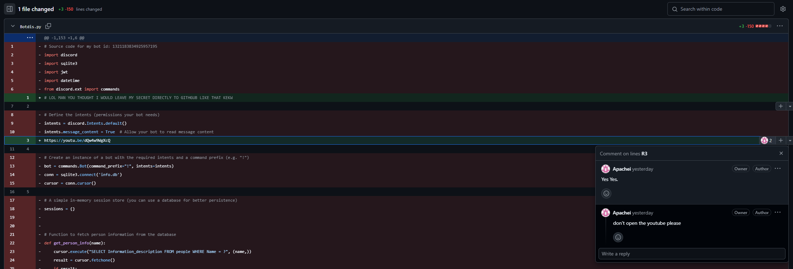

From here we kinda messed up and first blooded the challenge the wrong way. My teammate rcopstein noticed that the bot would capitalize the first character of each word you gave it
He came up with an exploit for it which would give the key

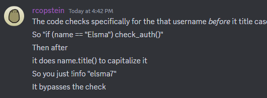

The correct way however is to find the hackers gist account which contains a single gist that has the secret key

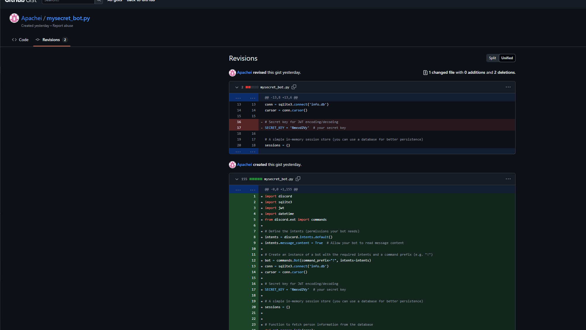

We can use the key to craft our admin JWT and get the info for Elsfa7 Elmrta7

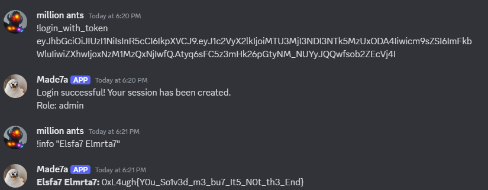

### FLAG: ``0xL4ugh{Y0u_So1v3d_m3_bu7_It5_N0t_th3_End}``