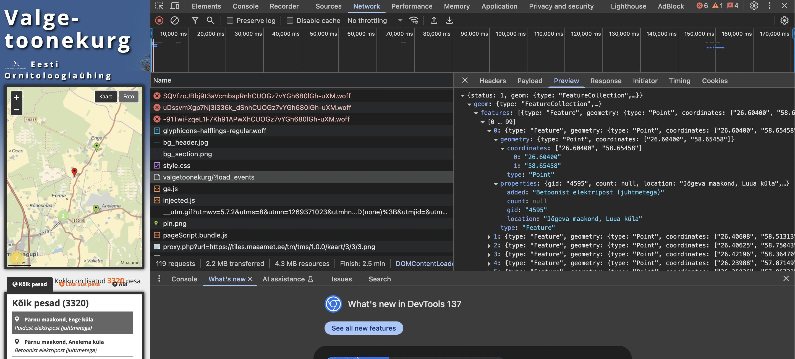

## Challenge Description

> Find the coordinates of the google maps location. The challenge lets you pan around like you'd be able to in geoguessr

## Solution

This was a pretty difficult challenge since we don't have a lot to go off of. However, with all the clues provided we can pinpoint the location.

The following details from the images are useful
1. The sign in the distance
    
2. The bird and the utility pole (obviously)
    
3. The overall landscape (curved dirt road, trees on the west, large field to the east)
    
4. Small shack behind the trees
    

With these details in mind we can start to narrow down the location. To start out if you do quick google search of nests on top of utility poles you'll notice that its pretty common in eastern europe.

This helps us get the region down and we can lookup which eastern european country uses that sign

Looks like we'll need to start our search in Estonia but we cant just look around blindly since that'd take forever. I ended up finding a site that tracks the nests of the white stork in Estonia
[eoy.ee/valgetoonekurg](https://www.eoy.ee/valgetoonekurg/)

This definitely helps but sorting through each one of these pins, taking each of their coordinates and checking street view would still take too long. We'll need to filter some locations out.

This selected slot window is perfect since it lists what kind if structure the nest is on. Thankfully we can export the JSON of all the pins data and use that to filter out all the locations that don't match ours.

> 
> This list is translated and is only the locations with a nest on a concrete pole without wires

Now that we have all the filtered results, we're left with a little over 400 results to look through. I asked chatGPT to use the coordinates from the JSON and make a KML Tour file that we could put into Google Earth.

Being able to quickly jump between the locations makes this a lot easier. We'll look for an area that looks similar to the one we've been given. Im looking for a bent dirt road next to a field where the google street view is right beside the nest coordinates.

Finally found it

### FLAG: ``L3AK{st0rk_3nthus1a5t!}``