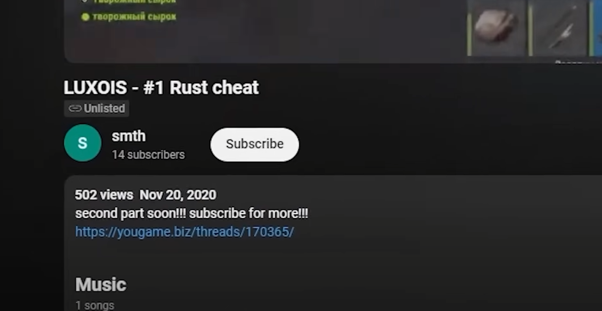
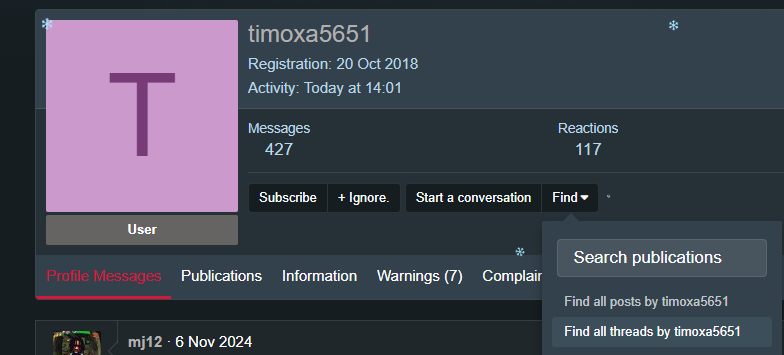
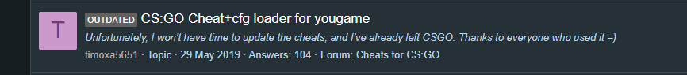

## Challenge Description

> A notorious cheat coder known as Destroyer2009 shook the competitive gaming world by disrupting a major event with a multi-million dollar prize pool, causing the competition to be halted. After vanishing from the scene, he has resurfaced under the radar, sharing a cheat tool for another competitive game on an obscure internet forum. Rumors of his return have surfaced, and traces of his online activity have been uncovered, pointing to a hidden post where he uploaded the cheat. Your mission is to follow the clues and find the full URL of the forum thread where the cheat was posted. Flag Format: 0xL4ugh{Thread Full URL [XXXXX://XXXXXXX.XXX/XXXXXXX/XXXXX/]}

## Solution

Theres a few key points to consider when doing our research for this challenge
1. Username is Destroyer2009
2. Disrupted a major gaming tournament
3. Made a cheat for another competitive game and posted on an obscure forum

This was a well known real world incident that occurred a while back where this hacker known as Destroyer2009 hacked a 5 million dollar Apex Legends tournament. Lots of OSINT has already been done trying to figure out who he is so it makes it really easy. Theres a youtube video by John Hammond that covers a lot of the main points.
<iframe width="100%" height="468" src="https://www.youtube.com/embed/pXZ-aVP_n64" title="YouTube video player" frameborder="0" allow="accelerometer; autoplay; clipboard-write; encrypted-media; gyroscope; picture-in-picture; web-share" allowfullscreen></iframe>

Since theres so much info on this guy already we’ll find out pretty fast that he normally goes by the alias timoxa5651 and that hes Russian.
My first step after this was to browse Unknown Cheats since its the biggest discussion forum site for game cheats.
From this I found some of his posts and it looks like he also plays Rust a lot and makes cheats for it too.
Thats pretty much where I stopped since I know from the given URL template that it wont fit since [Uknowncheats.me](http://Uknowncheats.me) ≠ XXXXXXX.XXX
By searching more online I came across someone who found a youtube video he posted on a Russian site called yougame.biz.

This had to be the site since https://yougame.biz/threads/ID fit perfect with the template. I just need to find the thread ID.
I went to the thread and find his profile but it seemed like all his posts were from 2020 or newer, however since the thread ID for all those posts are 6 digits long I knew it had to be an older post.
We then go to all threads to search

Scroll through and I found an old post for CSGO and as we know from the problem description we’re looking for another competitive game.

You end up with a 5 digit thread and that ends up being the post https://yougame.biz/threads/84149/
### FLAG: ``0xL4ugh{https://yougame.biz/threads/84149/}``