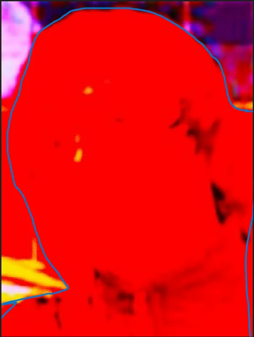
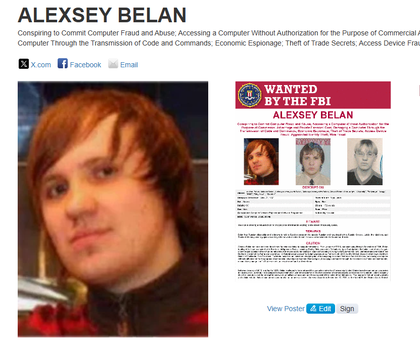
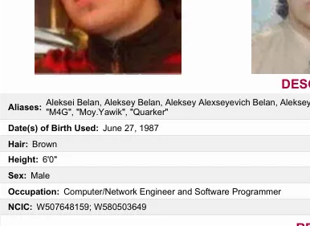

## Challenge Description

> A cybercriminal responsible for a series of high-profile ransomware attacks has vanished. The only remaining clue is a fragmented NCIC number hidden within the investigation's scattered files. A corrupted image, found on a dark web server, is believed to be linked to the suspect, who is rumored to be on the FBI's Most Wanted list. Your mission is to reconstruct the NCIC number. Flag Format: 0xL4ugh{WXXXXXXX59}

## Solution

Even with this corrupted image you can still make out certain details in the picture like some of the background shapes and his outline

Since the description says hes a cyber criminal and on the FBI most wanted list I decided to check out this list of people for someone who looks similar: https://www.fbi.gov/wanted/cyber 

Scrolling through some of the people on the page I eventually came across a picture that looked simialr to the corrupted image were given.

Looking more through his FBI wanted profile we'll see a NCIC Number that matches our flag.

### FLAG: ``0xL4ugh{W507648159}``

