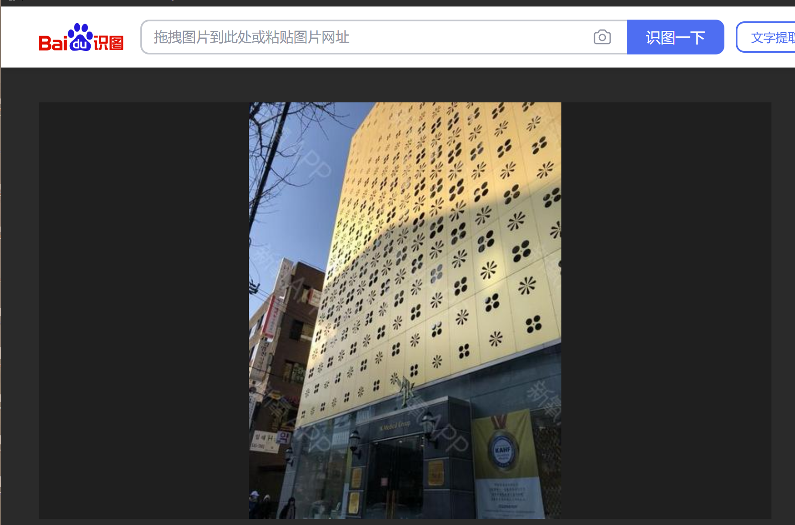
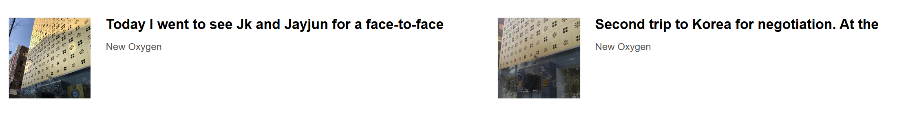

## Challenge Description

> I was thinking of getting some facial contouring plastic surgery done, but didn't know who to go to. My friend said they had a recommendation for a doctor specializing in that, but only sent me this photo of some building. Who's the doctor?
Before submitting, wrap the doctor's name in `uoftctf{}`. Special characters allowed, [First] [Last] format.

## Solution

Fairly easy challenge
I first did a reverse image search on Google which returned similar looking buildings however the suroundings for them didnt match the current image
I then decided to try my luck with Baidu Images which returned a promissing looking building with the word "Medical" above the door

This also gives a name and location for the establishment

Just to be sure I verified the image given with a Google maps street view of the location

From here its as easy as searching "jk plastic surgery clinic facial contouring" and seeing the list of doctors on their site

### FLAG: ``uoftctf{Sung-Sik Kim}``

